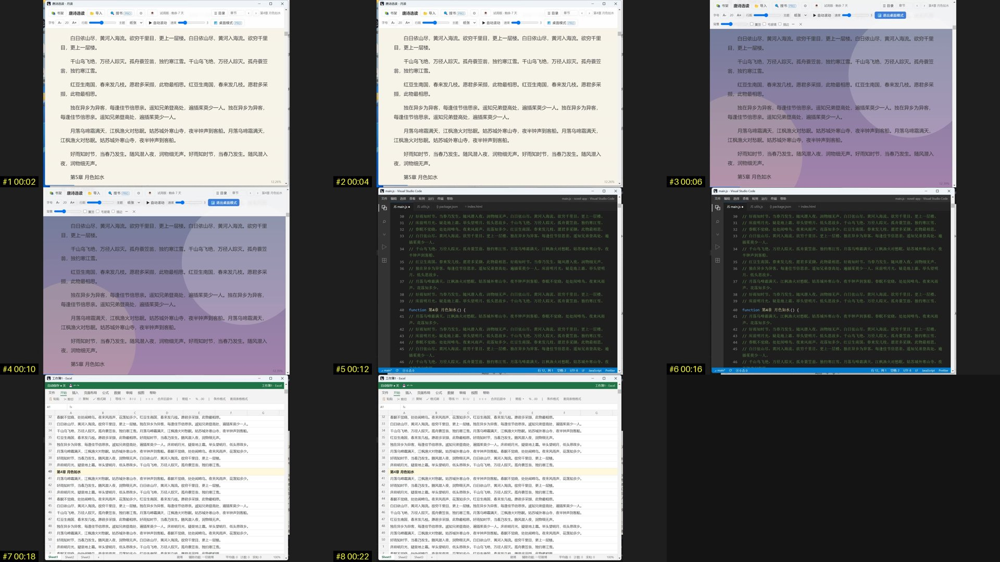

# 阅影 yueying

**让 AI 编程助手看懂视频。** Claude Code、Cursor 这些工具读得了图片和文字，却读不了视频。阅影把一段视频（本地文件，或 B站 / YouTube / 抖音 / 小红书等链接）拆成 AI 能读的东西：

- **文字稿**：优先抓平台自带字幕；没有就用本地语音识别（faster-whisper），中、英、日、韩、法、德、俄等几十种语言自动检测，全程离线，不上传、不花钱
- **关键帧**：在画面明显变化的地方抽帧，每张左下角烧上编号和时间；再拼成九宫格总览图，AI 一眼看完全片走向
- **一份 report.md**：简介、章节、画面总览、关键帧清单、按段落带时间戳的文字稿，AI 读这一个文件就能开始干活

然后你就可以对 Claude 说：「帮我看看这个视频，把里面的步骤整理成笔记」「照着这个教程把代码写出来」「这个视频 10 分钟处讲了什么」。

## 效果预览

一段 24 秒的演示视频（四张软件截图配中文旁白）跑出来的九宫格总览图，左下角黄字是帧编号和时间：



同一段视频的文字稿（本地语音识别，自动检测为中文）：

```
[00:00] 这是阅读,一个安静的桌面小说阅读器。整本书连续滚动,按段落记住进度。第二个画面是桌面模式,窗口变透明,只留文字浮在桌面上。第三个画面是伪装皮肤,一键变成代码编辑器。最后是伪装成表格的样子。
```

「月读」被听成了「阅读」，同音字是语音识别的通病，AI 读的时候会拿画面上的文字纠正。一个 6 分钟的 B站 视频，在 RTX 5060 笔记本上从下载到出报告约 90 秒。

## 安装

需要 Python 3.9 以上。ffmpeg 会自动带上，不用单独装。

**Windows**：下载本仓库，双击 `install.cmd`。它会创建独立的 Python 环境、装好依赖、把 Claude Code 技能放到 `~/.claude/skills/yueying`。

**手动安装（任何系统）**：

```bash
pip install yueying                 # 或 pipx install yueying
pip install "yueying[cuda]"         # 有 NVIDIA 显卡再加这个，语音识别快很多
yueying --install-skill             # 把 Claude Code 技能装到 ~/.claude/skills/yueying
```

想装 GitHub 上的最新版：`pip install git+https://github.com/vsh5dvsch7-png/yueying.git`。

装好技能后，Claude Code 会在需要看视频时自动调用它。Cursor 等支持 Agent Skills 标准的工具，把 `~/.claude/skills/yueying/SKILL.md` 复制到对应目录即可。

第一次做语音识别会下载模型（默认 large-v3-turbo，约 1.6 GB）。国内访问 HuggingFace 慢的话，程序会自动切换到 hf-mirror.com 镜像。

## 用法

```bash
yueying 视频.mp4
yueying "https://www.bilibili.com/video/BVxxxx"
yueying "https://www.youtube.com/watch?v=xxxx" --out ./notes/xxx
```

输出目录默认是 `./yueying_out/<视频名>/`：

```
report.md          给 AI 读的总索引
transcript.txt     按段落、带时间戳的文字稿
transcript.srt     字幕文件，可直接给播放器用
grid_01.jpg ...    九宫格总览图
frames/            单帧大图，f003_00m15s.jpg 这样命名
manifest.json      给程序读的结构化结果
```

常用参数：

| 参数 | 作用 |
|---|---|
| `--lang zh` | 指定语言（默认自动检测） |
| `--model small` | 换小模型，没显卡的机器快很多；可选 tiny / base / small / medium / large-v3 / large-v3-turbo |
| `--device cpu` | 强制用 CPU |
| `--frames 30` | 最多抽多少帧（默认按时长自动，上限 60） |
| `--scene 0.2` | 场景切换灵敏度，越小越敏感 |
| `--no-asr` | 没字幕也不做语音识别（只要画面） |
| `--no-frames` | 不抽画面（只要文字） |
| `--force-asr` | 有字幕也重新识别 |
| `--cookies-from-browser chrome` | 用浏览器登录态下载（B站 高清 / 会员视频） |
| `--keep` | 保留下载的原视频 |

## 在 Claude Code 里用

装好技能后，直接说：

> 帮我看看 D:\课程\第3课.mp4，把知识点整理成笔记

> 这个视频 https://www.bilibili.com/video/BVxxxx 里的代码帮我抄下来

Claude 会自己跑 `yueying`，读 report.md 和关键帧，然后按你的要求整理。引用视频内容时它会带上时间点，方便你回看。

## 工作原理

```
视频/链接 ──► yt-dlp 下载（≤720p）+ 抓字幕
          ──► ffmpeg 抽 16k 音频 ──► faster-whisper 识别（有字幕则跳过）
          ──► ffmpeg 场景检测 ──► 抽帧 ──► Pillow 烧时间戳、拼九宫格
          ──► report.md / transcript / manifest.json
```

代码都在 `src/yueying/`，每个文件一件事：

| 文件 | 管什么 |
|---|---|
| `cli.py` | 命令行入口，串起下面几步 |
| `download.py` | yt-dlp 下载、挑字幕语言 |
| `ffm.py` | ffmpeg 封装：探测时长分辨率、抽音频、导内嵌字幕 |
| `subs.py` | 解析 srt / vtt / B站 json 字幕，去掉 YouTube 自动字幕的重复 |
| `asr.py` | faster-whisper 语音识别，自动选 GPU / CPU，失败回退 |
| `frames.py` | 场景检测、定抽帧时间点、抽帧、烧时间戳、拼九宫格 |
| `report.py` | 生成 report.md、transcript、manifest |

## 常见问题

**识别不准？** 换大模型 `--model large-v3`，或指定语言 `--lang ja`。专有名词和代码容易听错，以画面为准，AI 会对照关键帧。

**B站 下载失败？** 试试 `--cookies-from-browser chrome`（先在 Chrome 里登录 B站）。

**没有 NVIDIA 显卡很慢？** 用 `--model small`，一段 10 分钟的视频大约 1 到 2 分钟识别完。

**想要更多画面？** `--frames 60 --scene 0.2`。

## 致谢

- [faster-whisper](https://github.com/SYSTRAN/faster-whisper)、[yt-dlp](https://github.com/yt-dlp/yt-dlp)、[imageio-ffmpeg](https://github.com/imageio/imageio-ffmpeg)、[Pillow](https://python-pillow.org/)
- 九宫格烧时间戳的做法参考了 [video-vision-mcp](https://github.com/OAMaestro/video-vision-mcp)，按时长分档抽帧参考了 [video-analyzer-skill](https://github.com/bsisduck/video-analyzer-skill)

## 许可

MIT
